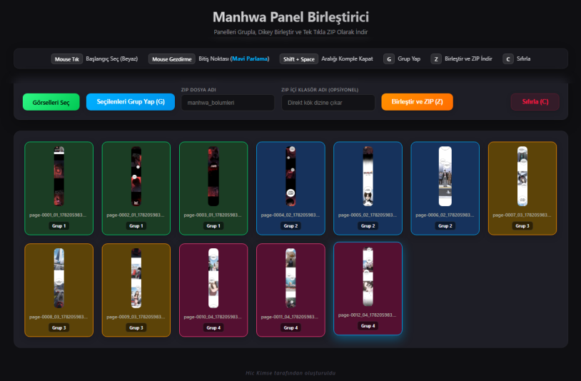
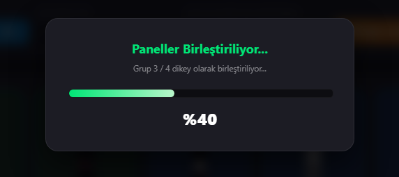

# 🗺️ Manhwa Panel Merger & ZIP Packager (V11)

Scanlation ekipleri ve webtoon okurları için geliştirilmiş, dikey manhwa panellerini akıllıca gruplayıp birleştiren ve tek tıkla ZIP formatında indiren **ultra modern, tarayıcı tabanlı** bir araçtır.

---

### 🌐 Canlı Uygulama & İndirme Seçenekleri
> 🚀 **Aracı tarayıcınızda canlı kullanmak için tıklayın:**  
> **[Uygulamayı Canlı Aç (GitHub Pages)](https://hickimse123.github.io/manhwa-panel-birlestirici/)**
>
> 💾 **İnternetsiz (Çevrimdışı) kullanmak için direkt bilgisayarınıza indirin:**  
> **[index.html Dosyasını Direkt İndir (Sağ Tıkla -> Farklı Kaydet)](https://raw.githubusercontent.com/hickimse123/manhwa-panel-birlestirici/main/index.html)**

---

## 🚀 Öne Çıkan Özellikler

* **⚡ %100 Sunucusuz (Client-Side):** Görselleriniz hiçbir sunucuya yüklenmez, doğrudan tarayıcınızda işlenir. Gizliliğiniz ve ham bölümleriniz güvendedir.
* **📂 Akıllı Dosya İsimlendirme:** İndirilecek ZIP dosyasının adını ve ZIP içindeki klasör yapısını tamamen siz belirlersiniz (Örn: `Bölüm 01/001.webp`).
* **🎨 Premium Dark UI:** Uzun süreli edit ve scan çalışmalarında gözü yormayan modern, Cyberpunk esintili cam (Glassmorphic) efektli arayüz.
* **🔢 Doğal Sıralama (Natural Sort):** Dosya adlarındaki sayıları (1, 2, 10, 11) işletim sistemi mantığıyla kusursuz sıralar.
* **⌨️ Hibrit Klavye ve Mouse Odaklanması:** `Shift + Space`, `G`, `Z` ve yön tuşları gibi kısayollarla mouse kullanmadan ışık hızında gruplama yapabilirsiniz.

## 🛠️ Nasıl Kullanılır?

1. **Görselleri Seçin:** Birleştirmek istediğiniz panelleri içeri aktarın.
2. **Gruplayın:** İster mouse ile sürükleyerek, ister klavye kısayollarıyla birleşmesini istediğiniz panelleri seçip `G` tuşuna basarak gruplar oluşturun.
3. **Ayarları Yapın:** ZIP dosya adını ve isterseniz ZIP içindeki klasör adını girin.
4. **İndirin:** `Z` tuşuna veya indirme butonuna basarak dikey olarak birleştirilmiş `.webp` panellerinizi anında ZIP olarak indirin.

---
Created by **Hic Kimse** 🚀
